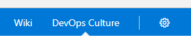

# DevOps Culture

You can't buy DevOps but you can install it into your VSTS account.

## Install

You can navigate to the [marketplace](https://marketplace.visualstudio.com/items?itemName=gordon-beeming.devops-culture) to install the extension.

## Discover

Once installed you can you will find a new hub group that is a solid indicator that you now have a DevOps Culture.

